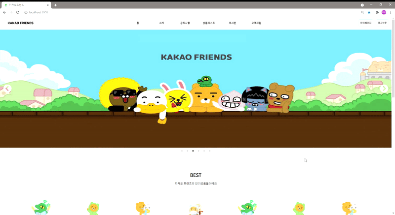
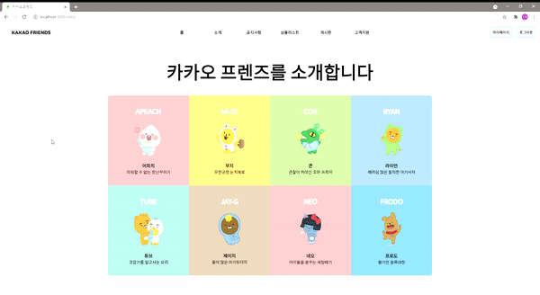
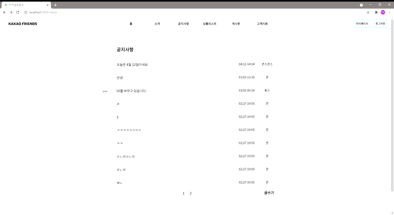
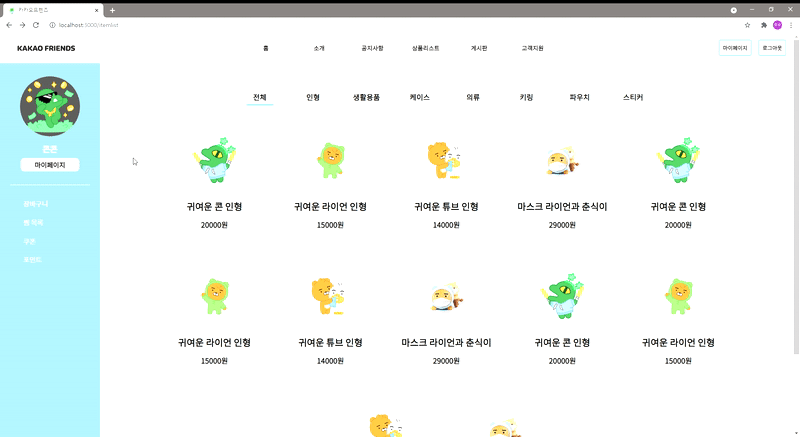
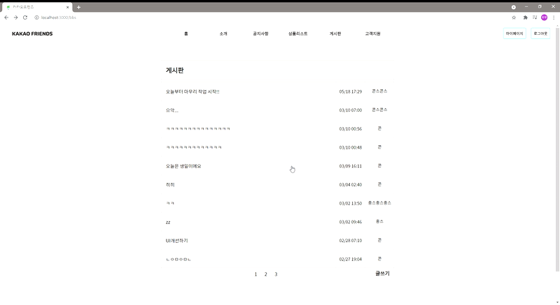
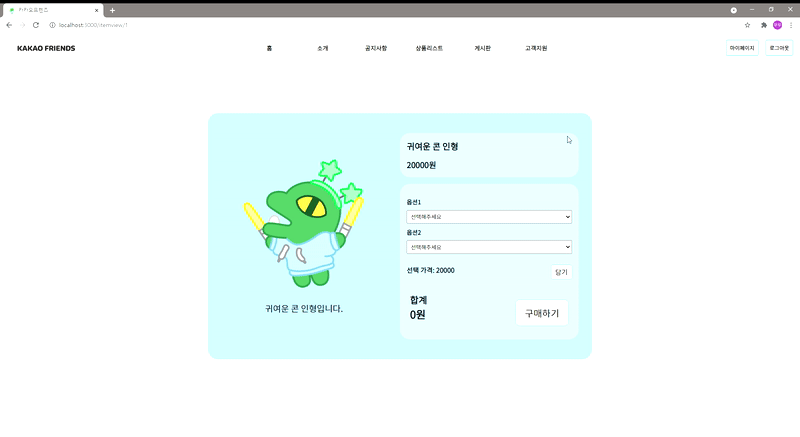
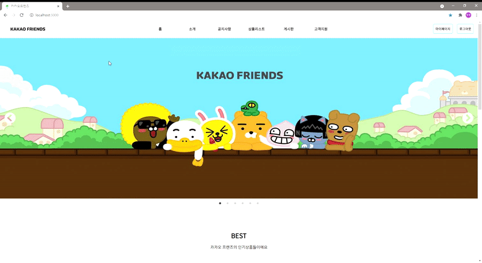
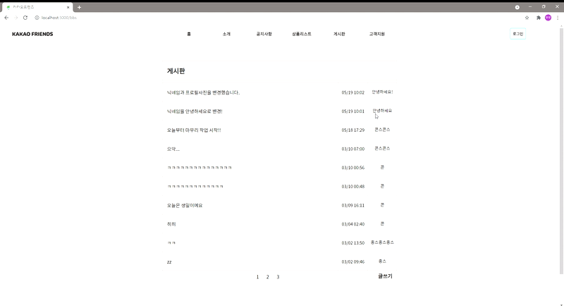
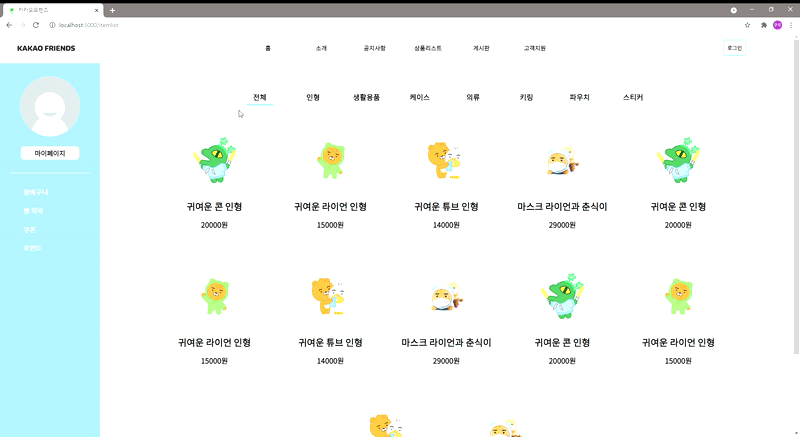
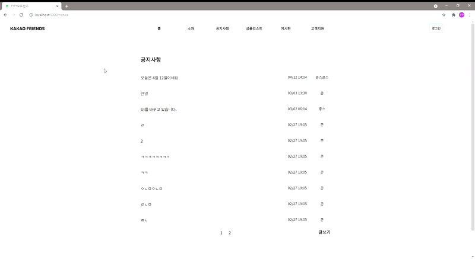

# 카카오 쇼핑몰 프로젝트

카카오 쇼핑몰을 직접 만들어보고 싶다고 생각하여 진행하게 된 프로젝트입니다.\
웹사이트의 컨셉은 커뮤니티 게시판과 쇼핑몰이 융합되어있는 점입니다.\
회원들이 커뮤니티 게시판에서 소통하고 상품에 대한 정보를 공유하며 구매하면 더욱 더 좋은 선택을 할 수 있고 재미도 있지 않을까라는 생각에 이런 구성을 선택하게 되었습니다.\
카카오의 아기자기한 캐릭터들에 어울리는 아기자기한 UI로 구성하려고 노력하였습니다.

 

### `계기`

리액트를 처음으로 배우고 나서 혼자서 공부를 해야했는데 어떤 웹사이트를 만드는 것이 가장 여러방면에서 공부에 도움이될까 생각해보니 쇼핑몰 웹사이트를 만드는 것이 가장 도움이 될 것이라는 생각이 들었습니다.

그 이유는 상품리스트의 컴포넌트화, 회원관리시스템 구현, DB와의 연동으로 상품정보 불러오기, 게시판 기능을 활용한 게시글 업로드, 읽기, 추천하기 등의 다방면의 기능들을 실제로 스스로 만들어 볼 수 있기 때문입니다.

 
 

### `사용 기술`

REACT Hook / REACT Router / CSS / HTML / Firebase / slick-carousel

 
 

### `웹사이트 기능 소개`

1. 메인 화면
   > 
   >
   > 웹사이트의 메인 화면입니다. 상단에 Navbar가 고정되어있고 Navbar의 아래에는 slick-carousel을 사용하여 만든 carousel이 들어가 있습니다. \
   > 실제로는 웹사이트의 광고나 이벤트 내용을 보여주는 용도로 사용하겠지만 일단은 카카오 프렌즈의 이미지만 5장이 일정 시간마다 슬라이드 되도록 만들었습니다. \
   > 그 아랫 부분은 컴포넌트를 활용하여 여러가지의 상품 목록을 보여줍니다. \
   > 상단은 인기상품, 하단은 신상품을 보여주게 하여 사용자가 어떤 상품이 인기가 있고 새로 나온 상품인지 첫 페이지에서 바로 알 수 있도록 설계하였습니다. \
   > (상품 리스트의 내용은 현재 몇가지의 데이터가 중복되어 반복적으로 출력되고있으며 이는 전체적인 웹사이트 구성을 마친 후에 업데이트 할 예정입니다.)

 
 
 

2. 소개
   > 
   >
   > 카카오 프렌즈에 대한 간단한 소개를 볼 수 있는 페이지입니다! \
   > 8명의 캐릭터를 각자의 고유 색을 배경으로 하여 사용자로 하여금 친밀감을 유도하고 클릭 시 간단한 소개를 볼 수 있는 modal창이 팝업됩니다.

 
 
 

3. 공지사항
   > 
   >
   > 공지사항을 볼 수 있는 페이지입니다.\
   > 저의 계정은 관리자로 되어있기 때문에 공지사항에 글을 작성, 삭제할 수 있으며 권한이 없는 사용자는 글을 작성, 삭제할 수 없도록 되어있습니다.\
   > 글 업로드시의 시간을 불러와서 글 작성 일자, 시간이 저장되도록 하였습니다.

 
 
 

4.상품리스트

> 
>
> 모든 상품들을 볼 수 있는 페이지입니다.\
> 모든 상품들은 분류로 나뉘어져 있으며 상단의 카테고리를 클릭하면 해당되는 상품들이 필터링되어 보여지도록 하였습니다.\
> 왼쪽에는 회원의 프로필사진과 닉네임 그리고 상품구매와 관련이 있는 메뉴들을 사용자가 한 번에 찾아 쉽게 사용할 수 있도록 배치하였습니다.\
> (왼쪽 메뉴의 목록들은 아직 구현하지 못했습니다.)

 
 
 

5. 게시판
   > 
   >
   > 회원 모두가 이용할 수 있는 게시판입니다.\
   > 회원이라면 모두가 글을 작성할 수 있으며 회원이 아니어도 글을 읽을 수 있습니다.\
   > 추천기능을 도입하여 인기 있는 글이 어떤 글인지 알 수 있습니다.\
   > 현재 이미지 업로드 기능과 댓글 기능은 개발 중에 있습니다.

 
 
 

6. 고객지원
   > 개발 중에 있습니다.

 
 
 

7.상품정보 페이지

> 
>
> 상품정보 페이지입니다.\
> 왼쪽에는 상품의 이미지와 간단한 소개가 보여집니다.\
> 상품의 옵션을 선택하여 담기 버튼을 누르면 나의 구매리스트에 담겨집니다.\
> 담겨진 품목은 +/- 버튼을 사용하여 수량을 조정할 수 있습니다.\
> 구매리스트는 따로 스크롤이 되도록 구성하여 공간을 최대한 낭비하지 않도록 하였습니다.\
> 추후 평점 시스템과 장바구니 시스템 등을 추가할 예정입니다.\
> (아직 구매하기 버튼을 눌렀을 때 구매 페이지로 이동되는 부분은 구현되지 않았습니다.)\

 
 
 

8.로그인

> 
>
> Firebase의 Google계정으로 로그인 기능을 사용하여 구현하였습니다.\
> Google계정으로 로그인을 하니 인증을 하는 데에 시간이 조금 소요되는 것으로 보입니다.

 
 
 

9.마이페이지

> 
>
> 마이페이지 기능입니다.\
> 닉네임과 프로필사진의 정보만 변경되도록 하였습니다.\
> 추후에 상품구매에 필요한 정보들까지 추가하고 정보 변경 전 인증절차를 추가할 예정입니다.\

 
 
 

10.로딩화면

> 
>
> 페이지가 새로고침될 때, 서버로부터 상품정보나 게시판의 게시물들에 대한 데이터들을 새롭게 받아와야합니다. 이 때 약간의 시간이 소요되며 이 때 로딩화면을 두어 사용자가 현재 어떤 상황에 있는지 알 수 있게 도와주는 로딩 화면을 구현하였습니다.

 
 
 

11.로그인과 관리자권한

> 
>
> 로그인을 하지 않으면 게시판의 글을 읽을 수는 있지만 글을 쓰거나 추천을 누르는 기능은 제한됩니다.\
> \
> \
> \
> 
>
> 로그인되지 않은 상태에서 상품을 구매하려하면 로그인을 해야한다는 메시지가 뜹니다.\
> \
> \
> \
> 
>
> 공지사항에서는 로그인되지 않은 상태이거나 관리자가 아닌 사용자가 게시물을 작성하려하면 제한됩니다.\
> 글을 읽는 것은 가능합니다.

 
 
 

### `소감`

리액트를 배우고 곧바로 시작해본 프로젝트입니다. 맨땅에서부터 시작하는 것이었기 때문에 많은 어려움이 있었습니다.\
예를 들면 페이지가 새로고침 될 때 서버로부터 상품들의 목록이나 게시물들의 목록을 받아오기 전에 렌더링요청이 먼저 되어 발생하는 오류 등의 어려움들에 직면하였는데 정말 많은 시간을 들여서 이런 문제들을 해결했을 때의 쾌감은 정말 최고였습니다.

 
 
 

### `부족한 점`

1. UI 디자인\
   깔끔한 UI를 추구하였으나 너무 깔끔하기만 하면 카카오 프렌즈의 이미지에 맞지 않지 않을까 하는 생각에 조금은 아기자기한 색감을 넣어보았습니다.\
   하지만 아직은 마음에 쏙 들지는 않습니다...\
   또한 게시판의 UI는 게시판 기능을 처음 만들어보는 입장이었기 때문에 UI는 틀만 만들어두고 일단 기능을 먼저 구현해보자! 라는 생각으로 일단 기능구현을 마쳤지만...
   학교 공부로 인해 손을 대지 못하고있는 상황입니다.

2. 구현되지 못한 부분들\
   방학이 되면 다시 시작할 예정입니다.

### `앞으로 추가할 예정인 기능들(여름방학)`

1. 게시판에서 상품을 태그할 수 있도록하기\
   사용자들끼리 쇼핑몰의 상품의 정보를 공유하고 리뷰를 남기고 추천하는 과정에서 게시글에 상품의 링크를 달면 해당 상품의 정보가 간략하게나마 표현되도록 한다면 조금 더 많은 사용자들을 해당 상품으로 이끌 수 있지 않을까 하는 생각에 생각해본 기능입니다. 이를 클릭하면 바로 이동되도록 (카카오톡에서 링크를 보냈을 때 밑에 해당 링크의 정보가 간략하게 나오는 기능과 같이) 구현하는 것이 목표입니다.

 

2. 상품 구매와 관련된 소기능들\
   장바구니, 쿠폰, 찜, 포인트 등의 기능들

 

3. 게시글 댓글 기능과 이미지 업로드 기능\
   1번의 내용을 효과적으로 구현하기 위해서는 반드시 필요한 기능입니다.

 

4. 상품 구매 버튼 클릭 후의 내용\
   결제 전 마지막 확인과 쿠폰 포인트 등의 사용, 배송정보 입력 등의 과정을 구현할 예정입니다.

 

5. 고객센터\
   고객들에게 도움이 될 수 있는 페이지를 구현할 예정입니다.
